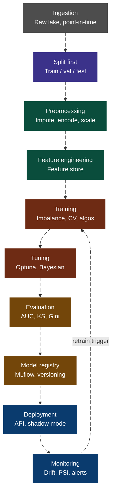

# Lab



## Services Summary

| Category               | Service                          | Purpose                                                     |
| ---------------------- | -------------------------------- | ----------------------------------------------------------- |
| **Compute / Dev**      | Jupyter                          | Interactive data science & experimentation environment      |
| **Object Storage**     | MinIO                            | S3-compatible storage for MLflow artifacts and pipelines     |
| **Database**           | Postgres                         | Metadata & application database (Airflow, MLflow, etc.)     |
| **DB UI**              | Adminer                          | Web UI to manage Postgres                                   |
| **ML Tracking**        | MLflow                           | Experiment tracking, model registry, artifact storage       |
| **Orchestration**      | Airflow (web + scheduler + init) | DAG-based pipeline orchestration                            |
| **Container Mgmt**     | Portainer                        | Docker UI for managing containers                           |
| **Homepage UI**        | Homepage                         | Central dashboard for services                              |
| **Metrics**            | Prometheus                       | Time-series metrics storage & scraping                      |
| **Metrics Source**     | cAdvisor                         | Collects Docker container metrics                           |
| **Visualization**      | Grafana                          | Dashboards for metrics, logs, traces                        |
| **Telemetry Agent**    | Grafana Alloy                    | Collects Docker logs and receives Faro frontend telemetry    |
| **Logs (storage)**     | Loki                             | Log aggregation & storage                                   |
| **Frontend Obs**       | Grafana Faro receiver            | Browser telemetry intake exposed by Alloy                   |
| **Code Quality**       | SonarQube                        | Local code quality analysis endpoint                        |
| **Tracing (pipeline)** | OTel Collector                   | Collects and routes telemetry data                          |
| **Tracing (storage)**  | Tempo                            | Distributed tracing backend                                 |
| **SSO/Auth**           | Authelia                         | Authentication & authorization (SSO)                        |
| **Reverse Proxy**      | Caddy                            | Routing + TLS + SSO integration                             |
| **LLM Inference**      | llama.cpp                        | Local LLM server for inference                              |
| **Init Jobs**          | Portainer-init                   | Automates initial setup (e.g., OAuth config)                |

### Observability

| Type    | Stack                  |
| ------- | ---------------------- |
| Metrics | Prometheus + cAdvisor  |
| Logs    | Grafana Alloy + Loki   |
| Traces  | OTel Collector + Tempo |
| UI      | Grafana                |

## Running Locally

1. Run the containers:

```sh
make up
```

## Useful commands

- Check repository in _github_ url

```sh
gh repo view --web
```

- Docker containers resource consumption:

```sh
docker stats --format "table {{.Name}}\t{{.CPUPerc}}\t{{.MemUsage}}\t{{.MemPerc}}"
```

## References

- [Sagemaker Pipeline Local Mode](https://developers.cyberagent.co.jp/blog/archives/58870/)
- [scikit_learn_bring_your_own_container_local_processing](https://github.com/aws-samples/amazon-sagemaker-local-mode/blob/main/scikit_learn_bring_your_own_container_local_processing/scikit_learn_bring_your_own_container_local_processing.py)
- [scikit_learn_bring_your_own_container_and_own_model_local_serving](https://github.com/aws-samples/amazon-sagemaker-local-mode/tree/main/scikit_learn_bring_your_own_container_and_own_model_local_serving)
- [feast.dev docs](https://rtd.feast.dev/en/latest/#feast.repo_config.RepoConfig)
- [sagemaker-pipelines-bridging-the-gap-between-local-testing-and-deployment](https://aws.plainenglish.io/sagemaker-pipelines-bridging-the-gap-between-local-testing-and-deployment-b5fcd8694b80)
- [tensorflow_bring_your_own_california_housing_local_training_and_batch_transform/](https://github.com/aws-samples/amazon-sagemaker-local-mode/blob/main/tensorflow_bring_your_own_california_housing_local_training_and_batch_transform)
- [automating-feature-engineering-workflows-with-amazon-managed-workflows-for-apache-airflow-mwaa](https://medium.com/@TransformationalLeader_Surjeet/automating-feature-engineering-workflows-with-amazon-managed-workflows-for-apache-airflow-mwaa-b557aa46b1f5)
- [integrating-opentelemetry-for-logging-in-python-a-practical-guide](https://medium.com/@lakinduboteju/integrating-opentelemetry-for-logging-in-python-a-practical-guide-fe52bff61edc)
- [Qwen2.5-Coder-1.5B-Instruct-GGUF](https://huggingface.co/Qwen/Qwen2.5-Coder-1.5B-Instruct-GGUF)
- [LFM2.5-350M-GGUF](https://huggingface.co/LiquidAI/LFM2.5-350M-GGUF)
- [mastering-aws-cli](https://github.com/SpillwaveSolutions/mastering-aws-cli/blob/main/references/s3.md)
- [sagemaker-ml-workflow-with-apache-airflow](https://github.com/aws-samples/sagemaker-ml-workflow-with-apache-airflow/blob/master/README.md)
