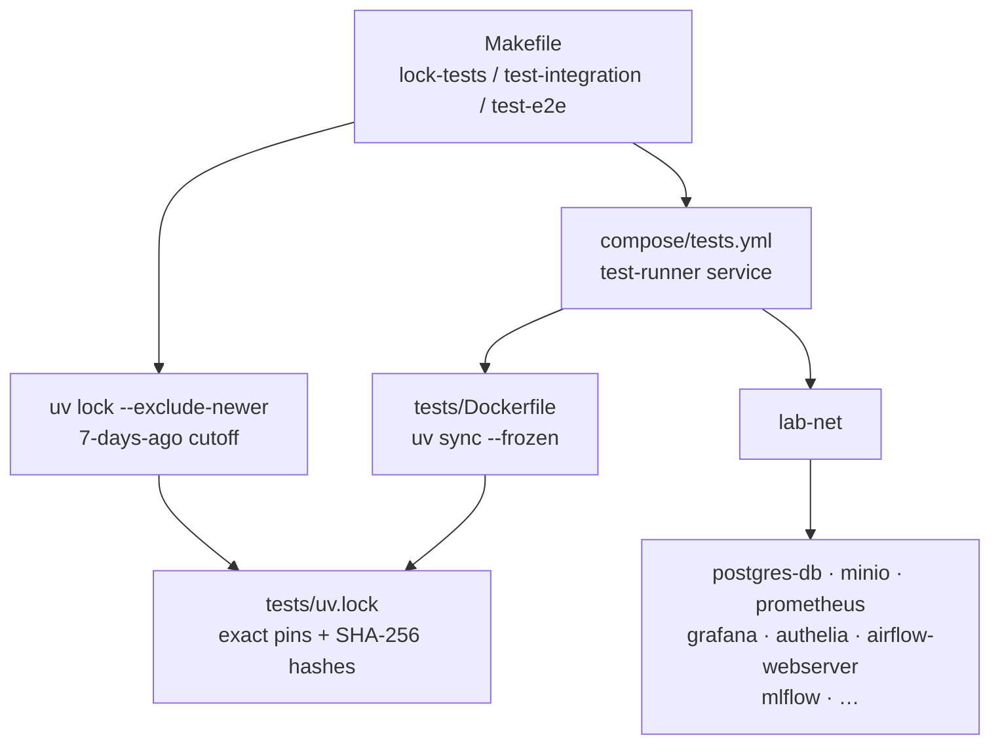

# Task: Bootstrap test infrastructure with uv security hardening and test runner container

## Priority

P0 — All other test tasks depend on this. No test code can be written until the environment, lockfile, and compose service exist.

## Dependencies

- No task dependency; this is the foundation task.
- No ADR dependency; the supply-chain approach uses native uv features — `--exclude-newer` at lock time and `require-hashes` at install time — with no custom tooling required.
- Depends on `lab-net` Docker bridge network existing in `compose/storage.yml` (already present).
- Depends on `/var/run/docker.sock` being accessible on the host (already used by Airflow and Portainer).

## Assignability

**AFK** — all requirements are fully resolved. Supply-chain protection uses native uv flags; no open architectural decisions remain. Safe to delegate.

## Context

The lab has no test infrastructure. Tests for integration and E2E scenarios need:

1. A Python environment managed by `uv` with an exact-version lockfile and SHA hashes (`require-hashes = true`).
2. Supply-chain age protection via `uv lock --exclude-newer` — uv natively refuses to resolve packages published within a configurable window, so no custom script is needed.
3. A Dockerfile that builds a `test-runner` image installing from the lockfile reproducibly with `uv sync --frozen`.
4. A `compose/tests.yml` service that joins `lab-net` so integration and E2E tests reach real service endpoints by container name.
5. Makefile targets that delegate test invocations to the container and expose a `lock-tests` target that enforces the age window on every dependency update.

## Use Cases

- **Feature**: Test infrastructure bootstrap
- **Scenario**: Developer runs integration tests in isolation
- **Given** the lab compose stack is running with the desired profiles
- **When** the developer runs `make test-integration`
- **Then** the `test-runner` container starts on `lab-net`, installs deps from the frozen lockfile, runs pytest-bdd scenarios, and exits with the test result code

- **Feature**: Supply chain protection
- **Scenario**: Developer updates a dependency to a version released 3 days ago
- **Given** the developer runs `uv add --project tests/ some-package==1.2.3`
- **When** they run `make lock-tests` to regenerate the lockfile
- **Then** uv exits with an error because `some-package==1.2.3` was published within 7 days — the lockfile is not updated

## Definition of Ready

- `lab-net` bridge network is confirmed present (it is, via `compose/storage.yml`).
- Docker socket access is confirmed on the developer machine.
- `uv` is installed on the host for the `lock-tests` target.

## Functional Requirements

- `FR-001`: `tests/pyproject.toml` declares `pytest`, `pytest-bdd`, `docker`, `playwright`, `pytest-playwright`, and `httpx` as direct dependencies with no upper bounds (exact versions pinned via lockfile).
- `FR-002`: `tests/pyproject.toml` sets `[tool.uv.pip] require-hashes = true` so `uv sync` enforces SHA-256 hash verification on every install.
- `FR-003`: `make lock-tests` runs `uv lock --project tests/ --exclude-newer $(shell date -u -d '7 days ago' +%Y-%m-%dT%H:%M:%SZ)`, which instructs uv to refuse resolving any package version published within the last 7 days.
- `FR-004`: `tests/uv.lock` is generated by `make lock-tests`, contains exact versions and SHA-256 hashes for all transitive dependencies, and is committed to git.
- `FR-005`: `tests/Dockerfile` is based on `python:3.12-slim`, copies `uv` binary, copies `tests/pyproject.toml` and `tests/uv.lock`, runs `uv sync --frozen`, and installs Playwright Chromium via `playwright install --with-deps chromium`.
- `FR-006`: `compose/tests.yml` defines a `test-runner` service that: uses the image built from `tests/Dockerfile`, mounts `./tests:/tests:ro`, mounts `./:/workspace:ro`, mounts `/var/run/docker.sock:/var/run/docker.sock`, and connects to `lab-net`.
- `FR-007`: Makefile adds targets `lock-tests`, `test-integration`, and `test-e2e` that run `docker compose -f compose/tests.yml run --rm test-runner pytest <relevant args>`. A `MARKS` variable allows `make test-integration MARKS=storage` to filter by marker.

## Non-Functional Requirements

- `NFR-001`: `uv sync --frozen` completes in under 60 seconds on a warm Docker cache.
- `NFR-002`: The test runner image must not store secrets; `DOCKER_HOST` is the only host-specific environment variable passed in.
- `NFR-003`: `tests/uv.lock` is committed to git so it can be audited and diffed on every dependency change.

## Observability Requirements

- `OBS-001`: When `make lock-tests` is blocked by the age check, uv's native error message names the offending package and version — no extra logging needed.
- `OBS-002`: Test run output uses pytest's default stdout format; CI captures it with standard log collection.

## Acceptance Criteria

- `AC-001`: **Given** all locked packages are >7 days old, **When** `make lock-tests` is run, **Then** `tests/uv.lock` is regenerated successfully and all entries have SHA-256 hashes.
- `AC-002`: **Given** a package version was published 3 days ago, **When** `make lock-tests` tries to resolve it, **Then** uv exits non-zero and the lockfile is not updated — prevents installing packages before community scrutiny.
- `AC-003`: **Given** the compose stack is up with the `storage` profile, **When** `make test-integration MARKS=storage` is run, **Then** the `test-runner` container reaches `postgres-db` and `minio` by container name.
- `AC-004`: **Given** `tests/uv.lock` is present, **When** the Dockerfile is built, **Then** `uv sync --frozen` installs exactly the locked versions with hash verification.
- `AC-005`: **Given** the Dockerfile is built, **When** `python -c "import playwright"` is run inside the container, **Then** it exits 0 and Chromium is present.

## Required Tests

### Unit Tests

Not applicable — this task produces infrastructure files and Makefile targets, not application logic with isolated functions to test.

### Integration Tests

- `IT-001`: **Scenario**: test-runner container resolves lab-net hostnames  
  **Given** the `test-runner` container is started via `compose/tests.yml`  
  **When** it resolves `postgres-db` by hostname  
  **Then** the hostname resolves to a valid IP on `lab-net`  
  Covers `FR-006`, `AC-003`.

### Smoke Tests

- `SMK-001`: **Scenario**: test-runner image builds cleanly  
  **Given** `tests/Dockerfile` and `tests/uv.lock` exist  
  **When** `docker build -f tests/Dockerfile tests/` is run  
  **Then** the image builds without error and `playwright` is importable  
  Covers `FR-005`, `AC-005`.

### End-to-End Tests

Not applicable — this task builds infrastructure, not a user journey.

### Regression Tests

Not applicable — no prior defect to guard against.

### Performance Tests

Not applicable — build time is bounded by `NFR-001`; no throughput requirement.

### Security Tests

- `ST-001`: Verify the test runner container has no environment variables containing secrets beyond `DOCKER_HOST` by inspecting `docker inspect` output after a test run. Covers `NFR-002`.

### Usability Tests

Not applicable — no user-facing UI or CLI output beyond test results.

### Observability Tests

Not applicable — no operational telemetry introduced by this task.

## Definition of Done

- `tests/pyproject.toml`, `tests/uv.lock`, `tests/Dockerfile`, and `compose/tests.yml` are committed.
- `make lock-tests` enforces `--exclude-newer` and exits 0 on the current lockfile.
- `make test-integration` and `make test-e2e` targets exist and invoke the test-runner container.
- The Dockerfile builds and Playwright Chromium is importable inside the container.
- `tests/uv.lock` is tracked by git.
