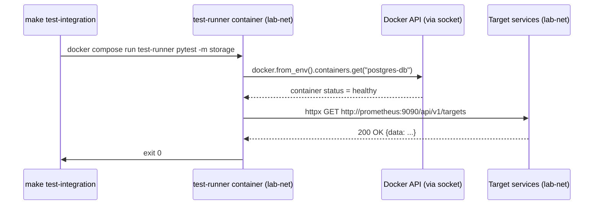

# Task: Integration tests for service health and inter-service connectivity

## Priority

P2 — Depends on Task 001 (test infrastructure). Can run in parallel with Task 002. Delivers real confidence that services communicate correctly within `lab-net`.

## Dependencies

- Depends on Task 001 (`001-test-infrastructure-bootstrap.md`) — `compose/tests.yml`, `tests/uv.lock` (with `docker`, `pytest-bdd`, `httpx`), and `make test-integration` target must exist.
- No ADR dependency; Docker Python SDK and pytest-bdd are native choices with no cross-cutting architectural impact.
- Requires the target profile stacks (`storage`, `observability`, etc.) to be running on `lab-net` before tests execute — the tests themselves do not start the stacks.

## Assignability

**AFK** — service names, healthcheck endpoints, and network topology are all defined in the compose files. No open decisions. Safe to delegate.

## Context

Integration tests verify that services actually start healthy, expose reachable endpoints on `lab-net`, and can communicate with their dependencies. They run inside the `test-runner` container on `lab-net`, using:

- **Docker Python SDK** (`docker.from_env()`) to assert container state (`running`, `healthy`) without relying on external ports.
- **`httpx`** to call internal service endpoints directly by container hostname.
- **pytest-bdd** for Gherkin feature files that serve as living documentation of expected service behavior.

Tests are tagged with pytest markers (`storage`, `observability`, `orchestration`, `sso`, `quality`) so each compose profile can be tested in isolation.

## Use Cases

- **Feature**: Storage stack health
- **Scenario**: postgres-db is reachable and healthy from within lab-net
- **Given** the `storage` profile stack is running
- **When** the integration tests marked `storage` are executed
- **Then** all storage service scenarios pass and the test-runner exits 0

- **Feature**: Observability stack health
- **Scenario**: Prometheus has active scrape targets
- **Given** the `observability` profile stack is running
- **When** the Prometheus targets endpoint is polled from the test-runner
- **Then** the response contains at least one target in the `up` state

## Definition of Ready

- Task 001 is complete: `compose/tests.yml`, `tests/uv.lock` (with `docker`, `pytest-bdd`, `httpx`), and `make test-integration` target exist.
- Target stacks can be started on `lab-net` using existing Makefile targets.

## Functional Requirements

- `FR-001`: Feature files live in `tests/integration/features/` with one file per stack profile (`storage.feature`, `observability.feature`, `orchestration.feature`, `sso.feature`, `quality.feature`).
- `FR-002`: Step definitions live in `tests/integration/steps/` with one module per feature file.
- `FR-003`: A `tests/integration/conftest.py` provides a session-scoped `docker_client` fixture (`docker.from_env()`) and a helper that retrieves a container by name and asserts its status is `running` or `healthy`.
- `FR-004`: Each test that calls a service HTTP endpoint uses `httpx` with a 5-second timeout and asserts status code and, where applicable, a JSON field.
- `FR-005`: Tests are registered with pytest markers: `@pytest.mark.storage`, `@pytest.mark.observability`, `@pytest.mark.orchestration`, `@pytest.mark.sso`, `@pytest.mark.quality`. The `make test-integration` target runs all markers; individual markers can be passed via `make test-integration MARKS=storage`.
- `FR-006`: No test starts or stops containers; all tests are read-only with respect to the running stack.

## Non-Functional Requirements

- `NFR-001`: Each individual scenario completes in under 10 seconds; the full integration suite under 2 minutes.
- `NFR-002`: Tests do not modify any service state (no writes to databases, no bucket creation, no config changes).

## Observability Requirements

- `OBS-001`: Failed step output includes the container name, expected status, actual status, and the HTTP response body (truncated to 500 chars) so failures are self-diagnosing.

## Acceptance Criteria

- `AC-001`: **Given** `postgres-db` is healthy, **When** `IT-001` runs, **Then** the step reports container status `healthy` and port `5432` accepts a TCP connection from the test-runner.
- `AC-002`: **Given** `minio` is healthy, **When** `IT-002` runs, **Then** `GET http://minio:9000/minio/health/ready` returns HTTP 200.
- `AC-003`: **Given** `prometheus` is healthy, **When** `IT-003` runs, **Then** `GET http://prometheus:9090/api/v1/targets` returns JSON with at least one `activeTargets` entry.
- `AC-004`: **Given** `grafana` is healthy, **When** `IT-004` runs, **Then** `GET http://grafana:3000/api/health` returns JSON with `"database": "ok"`.
- `AC-005`: **Given** `authelia` is healthy, **When** `IT-005` runs, **Then** `GET http://authelia:9091/api/health` returns HTTP 200.
- `AC-006`: **Given** `airflow-webserver` is healthy, **When** `IT-006` runs, **Then** `GET http://airflow-webserver:8080/api/v2/monitor/health` returns JSON indicating healthy scheduler and metadatabase.
- `AC-007`: **Given** the `quality` profile is running, **When** `IT-007` runs, **Then** `sonarqube` container status is `healthy`.

## Required Tests

### Unit Tests

Not applicable — unit tests for step helper functions belong in Task 002 scope; here only integration boundary behavior is tested.

### Integration Tests

- `IT-001`: **Scenario**: postgres-db is running and reachable  
  **Given** the `storage` profile stack is running  
  **When** the Docker client checks the `postgres-db` container  
  **Then** container status is `healthy`  
  **And** a TCP connection to `postgres-db:5432` succeeds from the test-runner  
  Covers `AC-001`, `FR-003`.

- `IT-002`: **Scenario**: MinIO health endpoint responds  
  **Given** the `storage` profile stack is running  
  **When** `GET http://minio:9000/minio/health/ready` is called  
  **Then** the response status is 200  
  Covers `AC-002`, `FR-004`.

- `IT-003`: **Scenario**: Prometheus has active scrape targets  
  **Given** the `observability` profile stack is running  
  **When** `GET http://prometheus:9090/api/v1/targets` is called  
  **Then** the response JSON contains at least one entry in `data.activeTargets`  
  Covers `AC-003`, `FR-004`.

- `IT-004`: **Scenario**: Grafana database connection is healthy  
  **Given** the `observability` profile stack is running  
  **When** `GET http://grafana:3000/api/health` is called  
  **Then** the response JSON field `database` equals `"ok"`  
  Covers `AC-004`.

- `IT-005`: **Scenario**: Authelia health endpoint responds  
  **Given** the `sso` profile stack is running  
  **When** `GET http://authelia:9091/api/health` is called  
  **Then** the response status is 200  
  Covers `AC-005`.

- `IT-006`: **Scenario**: Airflow API server reports healthy  
  **Given** the `airflow` profile stack is running  
  **When** `GET http://airflow-webserver:8080/api/v2/monitor/health` is called  
  **Then** the response JSON indicates the scheduler and metadatabase are healthy  
  Covers `AC-006`.

- `IT-007`: **Scenario**: SonarQube container is healthy  
  **Given** the `quality` profile stack is running  
  **When** the Docker client checks the `sonarqube` container  
  **Then** container status is `healthy`  
  Covers `AC-007`.

### Smoke Tests

Not applicable — service startup smoke is already covered by Docker healthchecks in the compose definitions. Integration tests here go one level deeper.

### End-to-End Tests

Not applicable — no browser-driven user journey is tested here. E2E tests are Task 004.

### Regression Tests

Not applicable — no prior defect is being guarded against.

### Performance Tests

Not applicable — the 10-second per-scenario budget in `NFR-001` is a practical timeout, not a performance benchmark.

### Security Tests

Not applicable — this task does not touch authentication, authorization, or trust boundaries. SSO login flows are verified in Task 004.

### Usability Tests

Not applicable — no user-facing UI output.

### Observability Tests

Not applicable — this task does not introduce or modify operational telemetry behavior.

## Definition of Done

- `tests/integration/features/` contains feature files for all five stacks.
- `tests/integration/steps/` contains step definition modules matching each feature.
- `tests/integration/conftest.py` provides `docker_client` and per-stack fixtures.
- `make test-integration` runs all scenarios and exits 0 when target stacks are healthy.
- `make test-integration MARKS=storage` runs only storage scenarios.
