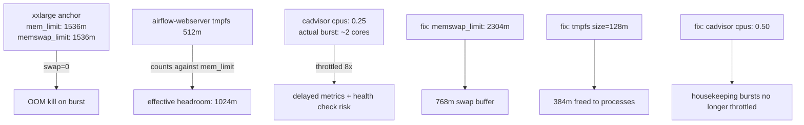

# Task: Fix memory limits and CPU caps to prevent OOM kills and CPU throttling

## Priority

P1 — Three compounding problems make container crashes likely under normal workload: zero swap headroom for the two largest services means any transient spike is an immediate OOM kill; the Airflow webserver reserves 512 MB of tmpfs that counts against its memory budget; and cAdvisor is being throttled at 8× below its actual burst need, which can cause health check timeouts.

## Dependencies

- No task dependency; can start independently.
- No ADR dependency; changes are within the existing resource-anchor pattern.

## Assignability

**AFK** — all three changes are in `docker-compose.yml` with deterministic target values. No architectural decision is required.

## Context

Three resource configuration problems exist simultaneously:

**1. Zero swap for xxlarge containers (`airflow-webserver`, `airflow-scheduler`)**
Every resource anchor sets `memswap_limit == mem_limit`, making swap size = 0. For the xxlarge tier (1536 MB), a transient allocation burst — e.g., the scheduler pip-installing `sagemaker[local]` or the webserver serving concurrent requests — goes directly to OOM kill with no grace period. The host has 4 GiB swap available. Setting `memswap_limit: 2304m` gives 768 MB of swap headroom (50% of mem_limit), matching Docker's recommended practice for burst-tolerant services.

**2. Airflow webserver tmpfs consumes 512 MB of the 1536 MB budget**
`docker-compose.yml:523`:
```yaml
tmpfs:
  - /tmp:size=512m
```
tmpfs pages count against the container's memory limit. 512 MB = 33% of the xxlarge budget is reserved for `/tmp`. SageMaker local mode writes small compose YAML files; 128 MB is sufficient. Reducing to `size=128m` frees 384 MB back to the JVM and Python processes.

**3. cAdvisor CPU limit too tight — currently being throttled**
Live `docker stats` shows cAdvisor consuming 26.69% of total host CPU against a `cpus: 0.25` limit (3.1% of total on an 8-core host). The container is throttled by ~8×, delaying metrics collection and causing CPU scheduler pressure on the host. cAdvisor uses `<<: *resources-small` (0.25 CPU / 192 MB). Memory is fine at 110 MB observed; only the CPU needs raising. Override `cpus` and the deploy CPU limit inline on the `cadvisor` service to `0.50` without changing the shared anchor.



## Use Cases

- **Feature**: Stable container operation under workload
- **Scenario**: Airflow scheduler runs a virtualenv task that installs heavy deps
- **Given** airflow-scheduler is running with 1536 MB mem_limit
- **When** `@task.virtualenv` installs `sagemaker[local]` during DAG execution
- **Then** the container uses swap instead of being OOM-killed

- **Scenario**: cAdvisor completes its 60-second housekeeping scan
- **Given** cAdvisor has a CPU limit of 0.50
- **When** the housekeeping interval fires and scans container filesystems
- **Then** the scan completes within the interval without health check timeout

## Definition of Ready

- `docker-compose.yml` is accessible.
- `x-resources-xxlarge` anchor is at line 116.
- `airflow-webserver` tmpfs is at line 523.
- `cadvisor` service uses `<<: *resources-small` at line 740.
- Host has sufficient swap available (`free -h` shows 4 GiB swap).

## Functional Requirements

- `FR-001`: The `x-resources-xxlarge` anchor must set `memswap_limit: 2304m` (1.5× the 1536 MB mem_limit).
- `FR-002`: The `deploy.resources` block in `x-resources-xxlarge` must remain unchanged (deploy-mode resources do not control swap; `memswap_limit` does).
- `FR-003`: The `airflow-webserver` tmpfs entry must be changed from `size=512m` to `size=128m`.
- `FR-004`: The `cadvisor` service must override `cpus: 0.50` and `deploy.resources.limits.cpus: "0.50"` inline, without modifying the `x-resources-small` anchor.
- `FR-005`: No other service's memory or CPU limits must change as a side effect.

## Non-Functional Requirements

- `NFR-001`: `docker compose config --quiet` must exit 0 after all changes.
- `NFR-002`: Combined peak memory across all running services must not exceed available host RAM (30 GiB observed; total theoretical peak across all services is well below 16 GiB).
- `NFR-003`: cAdvisor's memory limit (192 MB) must remain unchanged — only CPU changes.

## Observability Requirements

- `OBS-001`: After applying the fix, `docker stats cadvisor` CPU% must be below 12% of total host CPU (reflecting ≤ 0.50 CPU limit on 8 cores, with ≤ 80% utilization of that limit = 5%) at idle, and no longer show signs of severe throttling.
- `OBS-002`: `docker stats airflow-webserver` must show memory usage below 1280 MB (1536 MB limit − 128 MB tmpfs − headroom) during normal operation.

## Acceptance Criteria

- `AC-001`: **Given** the updated compose file, **When** `docker compose config` is inspected, **Then** `airflow-webserver` and `airflow-scheduler` show `memswap_limit: 2415919104` (2304 MB in bytes) or equivalent YAML.
- `AC-002`: **Given** the updated compose file, **When** `docker compose config` is inspected for `airflow-webserver`, **Then** the tmpfs entry reads `size=128m`, not `size=512m`.
- `AC-003`: **Given** the updated compose file, **When** `docker compose config` is inspected for `cadvisor`, **Then** `cpus: 0.5` appears in the service's resource limits.
- `AC-004`: **Given** `grep -n "memswap_limit" docker-compose.yml` is run, **Then** no service in the `x-resources-small`, `x-resources-medium`, or `x-resources-large` anchors has been changed.

## Required Tests

### Unit Tests

Not applicable — this task changes Docker Compose resource declarations; there is no isolatable function logic.

### Integration Tests

Not applicable — resource limit correctness is verified by compose config inspection and runtime stats.

### Smoke Tests

- `SMK-001`: **Scenario**: Compose config renders updated resource limits
  **Given** the updated `docker-compose.yml`
  **When** `docker compose config --quiet` runs
  **Then** it exits 0
  Covers `NFR-001`.

- `SMK-002`: **Scenario**: airflow-webserver container starts within memory budget
  **Given** the updated `docker-compose.yml` and `--profile airflow` active
  **When** `docker stats airflow-webserver --no-stream` runs after the container is healthy
  **Then** `MEM USAGE / LIMIT` shows a limit of `1.5GiB` and usage below `1.25GiB`
  Covers `AC-001`, `AC-002`, `OBS-002`.

- `SMK-003`: **Scenario**: cAdvisor operates without severe CPU throttling
  **Given** `--profile observability-extras` active with the updated CPU limit
  **When** `docker stats cadvisor --no-stream` runs after one housekeeping cycle (60 s)
  **Then** CPU% is below 12% of host total (the previous burst measurement was 26.69%)
  Covers `AC-003`, `OBS-001`.

### End-to-End Tests

Not applicable — no user journey involves resource limit declarations.

### Regression Tests

- `REG-001`: **Scenario**: Non-xxlarge services retain original limits
  **Given** the updated `docker-compose.yml`
  **When** `docker compose config` output for `postgres-db`, `grafana`, and `loki` is inspected
  **Then** their `mem_limit` and `memswap_limit` values are unchanged from before this task
  Covers `FR-005`.

### Performance Tests

Not applicable — this task adjusts declared limits, not measured latency or throughput.

### Security Tests

Not applicable — resource limits are not a security boundary in this context.

### Usability Tests

Not applicable — no user-facing behavior changes.

### Observability Tests

- `OT-001`: After container restarts, verify `docker stats` shows cAdvisor CPU% below 12% at idle and Airflow webserver memory usage below 1.25 GiB. Covers `OBS-001`, `OBS-002`.

## Definition of Done

- `x-resources-xxlarge.memswap_limit` is `2304m`.
- `airflow-webserver` tmpfs entry is `size=128m`.
- `cadvisor` service has inline `cpus: 0.50` and matching `deploy.resources.limits.cpus: "0.50"`.
- `x-resources-small`, `x-resources-medium`, and `x-resources-large` anchors are unchanged.
- `docker compose config --quiet` exits 0.
- `SMK-001`, `SMK-002`, `SMK-003`, and `REG-001` pass.
