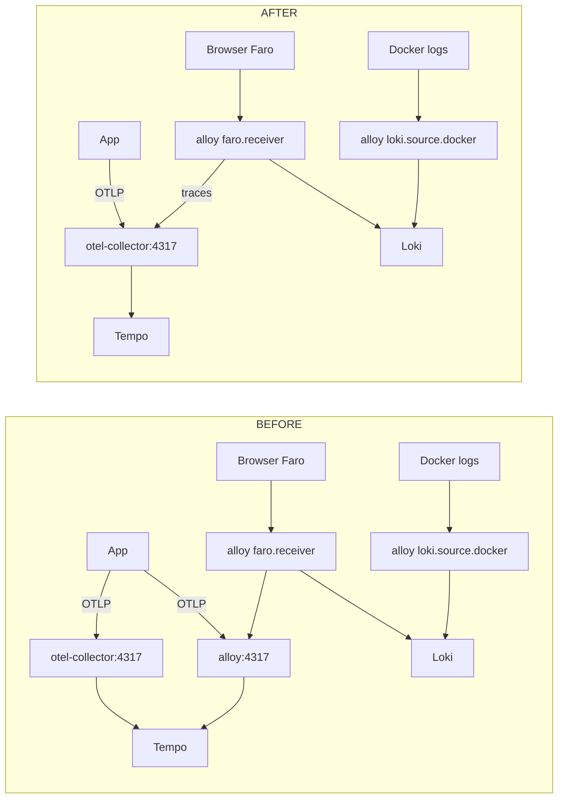

# Task: Remove duplicate OTLP receiver from Alloy config

## Priority

P2 — Two services (`alloy` and `otel-collector`) both run OTLP receivers on ports 4317/4318 inside the lab network and both route to the same Tempo backend. The overlap creates ambiguity about which path an application should use, wastes memory on a redundant receiver, and makes the pipeline harder to reason about.

## Dependencies

- No task dependency; can start independently.
- No ADR dependency; the division of responsibilities is clear from existing usage.

## Assignability

**AFK** — the correct routing is unambiguous: otel-collector is the designated OTLP ingress (port-mapped to host, referenced in `devcontainer.json`); alloy handles Docker log collection and Faro browser telemetry. Removing the OTLP block from alloy does not affect either path.

## Context

`services/alloy/config.alloy:80-101` contains an `otelcol.receiver.otlp "local"` block that listens on `0.0.0.0:4317` (gRPC) and `0.0.0.0:4318` (HTTP) and exports traces to `otelcol.exporter.otlp.tempo`. The `otel-collector` service (`services/otel/otel-config.yaml`) also receives OTLP on ports 4317/4318 and exports traces to `tempo:4317`. Both are in the `observability-extras` profile and run simultaneously.

`devcontainer.json:57` sets `OTEL_EXPORTER_OTLP_ENDPOINT: "http://otel-collector:4317"` — applications use otel-collector. `alloy` handles Docker container log scraping (`loki.source.docker`) and Faro browser telemetry (`faro.receiver`). The alloy OTLP block is dead code: no sender is configured to use `alloy:4317`.

The `otelcol.exporter.loki "local"` block (alloy line 99-101) forwards OTLP _logs_ to Loki. This is a separate pipeline from the OTLP traces path and must not be removed.

After removing the OTLP receiver block from alloy, the `otelcol.processor.batch "default"` and `otelcol.exporter.otlp "tempo"` blocks also become unreferenced and should be removed. The `otelcol.exporter.loki "local"` block becomes the only remaining OTLP exporter and is wired to faro output — it must be kept.

The faro receiver's `traces` output currently points to `otelcol.processor.batch.default.input` — after removing the batch processor from alloy, faro traces must be forwarded directly to `otelcol.exporter.otlp.tempo.input` — but since that exporter is also being removed, faro trace output should instead be routed to `otel-collector` via an OTLP exporter that targets `otel-collector:4317`.

This keeps faro traces going to Tempo via otel-collector, which is the intended single ingress.

## Use Cases

- **Feature**: Unified OTLP telemetry ingress
- **Scenario**: Developer sends application traces to otel-collector
- **Given** `OTEL_EXPORTER_OTLP_ENDPOINT=http://otel-collector:4317`
- **When** the application emits a trace span
- **Then** the span appears in Tempo (via otel-collector) and not in a competing alloy path

- **Scenario**: Faro browser traces still reach Tempo after the change
- **Given** the Faro JS SDK sends traces to `alloy:12347`
- **When** alloy receives the faro payload
- **Then** the trace is forwarded to otel-collector and appears in Tempo

## Definition of Ready

- `services/alloy/config.alloy` is accessible.
- `otel-collector` is running and `tempo:4317` is reachable from `otel-collector`.
- The `faro.receiver` output section at `alloy:143-146` is understood: it currently sends `traces` to `otelcol.processor.batch.default.input`.

## Functional Requirements

- `FR-001`: Remove `otelcol.receiver.otlp "local"` block from alloy config.
- `FR-002`: Remove `otelcol.processor.batch "default"` block from alloy config (it becomes unreferenced after FR-001).
- `FR-003`: Remove `otelcol.exporter.otlp "tempo"` block from alloy config (it becomes unreferenced after FR-002).
- `FR-004`: Add a new `otelcol.exporter.otlp "otelcol"` block targeting `otel-collector:4317` with `tls.insecure = true` in alloy config.
- `FR-005`: Update `faro.receiver "local"` output so `traces` points to the new `otelcol.exporter.otlp.otelcol.input`.
- `FR-006`: `otelcol.exporter.loki "local"` must remain unchanged — it is still used by faro logs output and OTLP log forwarding.
- `FR-007`: Alloy must start without errors after the change.

## Non-Functional Requirements

- `NFR-001`: Alloy memory usage must not increase after the change (removing a receiver frees memory).
- `NFR-002`: Alloy config must be syntactically valid — `alloy fmt --no-write services/alloy/config.alloy` must exit 0.

## Observability Requirements

- `OBS-001`: After the change, a trace sent to `otel-collector:4317` must appear in the Tempo UI via the Grafana → Explore → Tempo data source.
- `OBS-002`: Alloy UI at `http://localhost:12345` must show zero component errors after restart.

## Acceptance Criteria

- `AC-001`: **Given** the updated alloy config, **When** `grep "otelcol.receiver.otlp" services/alloy/config.alloy` runs, **Then** it returns no matches.
- `AC-002`: **Given** alloy is restarted with the updated config, **When** `curl -s http://localhost:12345/-/ready` runs, **Then** it returns HTTP 200.
- `AC-003`: **Given** the faro receiver is active, **When** a browser span is received by alloy, **Then** `alloy_otelcol_exporter_sent_spans_total{exporter="otelcol/otelcol"}` metric increments in the Alloy UI.
- `AC-004`: **Given** the updated config, **When** `grep "otelcol.exporter.otlp" services/alloy/config.alloy` runs, **Then** exactly one block named `"otelcol"` (targeting otel-collector) is present — no `"tempo"` block exists.

## Required Tests

### Unit Tests

Not applicable — Alloy River config has no isolatable unit logic.

### Integration Tests

Not applicable — component wiring is verified by the smoke test and observability test.

### Smoke Tests

- `SMK-001`: **Scenario**: Alloy starts without component errors after config change
  **Given** the updated `services/alloy/config.alloy`
  **When** `docker compose restart alloy` completes and 15 seconds pass
  **Then** `curl -sf http://localhost:12345/-/ready` exits 0
  Covers `AC-002`, `FR-007`.

### End-to-End Tests

Not applicable — Faro trace delivery is verified by the observability test.

### Regression Tests

Not applicable — no known prior defect.

### Performance Tests

Not applicable — removing a receiver reduces alloy memory use; no performance risk.

### Security Tests

Not applicable — this task removes an unused receiver; no trust boundary changes.

### Usability Tests

Not applicable — no user-facing behavior.

### Observability Tests

- `OT-001`: After restarting alloy, visit `http://localhost:12345` (Alloy UI), navigate to the graph view, and verify no component shows a red error state. Covers `OBS-002`, `AC-002`.
- `OT-002`: Query `alloy_otelcol_exporter_sent_spans_total` in Prometheus; after any faro trace is received, verify the counter increments for the `otelcol/otelcol` exporter. Covers `AC-003`, `OBS-001`.

## Definition of Done

- `otelcol.receiver.otlp "local"`, `otelcol.processor.batch "default"`, and `otelcol.exporter.otlp "tempo"` blocks removed from alloy config.
- New `otelcol.exporter.otlp "otelcol"` block added targeting `otel-collector:4317`.
- `faro.receiver "local"` traces output updated to the new exporter.
- `otelcol.exporter.loki "local"` unchanged.
- `SMK-001` passes.
- `OT-001` shows no component errors.
